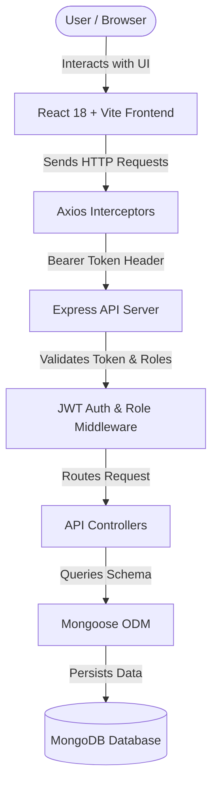

# CloudBlitz Enquiry Management System — Full-Stack CRM

CloudBlitz Enquiry Management System is a production-quality, full-stack CRM application designed for managing customer inquiries, assigning requests to staff agents, tracking progress, and performing role-based administration.

---

## 🌟 Key Features

- 🔐 **JWT Authentication & Authorization**: Secure login/registration with role enforcement (`ADMIN`, `MANAGER`, `AGENT`).
- 👤 **Default Admin Database Seeding**: Auto-seeds `admin@cloudblitz.com` on application startup.
- 📋 **Enquiry CRM Dashboard**:
  - Real-time stat cards (Total, New, In Progress, Closed).
  - Search across customer name, email, and phone number.
  - Multi-status tabs & assignee filter dropdowns.
  - Paginated enquiry table with view, edit, and soft-delete capabilities.
- 🗑️ **Soft-Delete Support**: `DELETE /api/enquiries/:id` archives records by timestamp without physically removing MongoDB documents.
- 👥 **Admin User Management**: Admin-only panel (`/users`) for creating, updating roles, and deleting staff accounts with safety guardrails against deleting the last remaining admin.
- 📜 **Interactive API Documentation**: Embedded Swagger UI accessible at `/api/docs`.
- 🧪 **Automated Testing Suite**: Jest & Supertest API integration tests.
- 🐳 **Docker Containerization**: Multi-stage Nginx frontend & Express backend orchestration with Docker Compose.

---

## 🏗 Architecture Diagram



---

## 🚀 Technology Stack

### Frontend
- **Framework**: React 18, Vite, TypeScript
- **Routing**: React Router DOM v6
- **Styling & UI**: Tailwind CSS, Lucide React Icons, Radix UI components
- **Forms & Validation**: React Hook Form, Zod, `@hookform/resolvers`
- **HTTP Client**: Axios with Request & Response Interceptors

### Backend
- **Runtime**: Node.js, Express, TypeScript
- **Database**: MongoDB & Mongoose ODM
- **Authentication**: JWT (`jsonwebtoken`), Password Hashing (`bcryptjs`)
- **Validation**: Zod
- **API Docs**: Swagger UI Express & OpenAPI 3.0

### Infrastructure & Testing
- **Testing**: Jest & Supertest
- **Containerization**: Docker, Docker Compose, Nginx

---

## 🔑 Default Credentials

The database automatically seeds a default administrator on startup if no admin exists:

| Role | Email | Password |
|---|---|---|
| **ADMIN** | `admin@cloudblitz.com` | `Admin@123` |

> [!NOTE]
> Demo login button available on the login page auto-fills these development credentials for quick access.

---

## 📁 Project Structure

```
cloudblitz-enquiry/
├── backend/
│   ├── src/
│   │   ├── config/      # DB & Swagger setup
│   │   ├── controllers/ # Auth, User & Enquiry logic
│   │   ├── middlewares/ # Auth & Centralized Error Handler
│   │   ├── models/      # Mongoose User & Enquiry schemas
│   │   ├── routes/      # Express endpoints
│   │   ├── utils/       # JWT, bcrypt, and Seeding helpers
│   │   ├── app.ts       # Express app setup
│   │   └── server.ts    # Application entrypoint
│   ├── tests/           # Jest & Supertest integration suite
│   ├── Dockerfile
│   ├── package.json
│   └── tsconfig.json
├── frontend/
│   ├── src/
│   │   ├── components/ # CRM UI components (Modal, Toast, Badges, Header, Sidebar)
│   │   ├── pages/      # Login, Register, Dashboard, Users
│   │   ├── layouts/    # Main App Layout
│   │   ├── routes/     # Protected & Admin Route Guards
│   │   ├── services/   # Axios API services
│   │   ├── hooks/      # Auth & Toast context hooks
│   │   ├── types/      # TypeScript interfaces
│   │   ├── App.tsx
│   │   └── main.tsx
│   ├── Dockerfile
│   ├── nginx.conf
│   ├── package.json
│   └── vite.config.ts
├── docker-compose.yml
├── LICENSE
└── README.md
```

---

## 🛠️ Local Development Setup

### 1. Prerequisites
- Node.js (v18+ or v20+)
- MongoDB (Running locally on port `27017` or via Docker)
- npm or yarn

### 2. Backend Setup
```bash
cd backend
npm install
npm run dev
```
The backend server runs at `http://localhost:5000`.  
API Swagger Documentation is available at `http://localhost:5000/api/docs`.

### 3. Frontend Setup
```bash
cd frontend
npm install
npm run dev
```
The Vite development app will open at `http://localhost:5173`.

---

## 🧪 Running Automated Tests

Run the integration test suite in the backend directory:

```bash
cd backend
npm test
```

Tests cover:
- `/api/health` system status
- User Registration, Login & Invalid Credentials
- Protected `/api/auth/me` endpoint
- Enquiry Creation, Querying, Updates & Soft-delete
- Admin-only User Management authorization checks

---

## 🐳 Docker Deployment

To spin up the entire application stack (Frontend, Backend, MongoDB) with a single command:

```bash
docker compose up --build
```

Access services:
- **Frontend App**: `http://localhost`
- **Backend API**: `http://localhost:5000`
- **Swagger Docs**: `http://localhost:5000/api/docs`
- **MongoDB**: `localhost:27017`

---

## 📖 API Documentation Summary

| Method | Endpoint | Access | Description |
|---|---|---|---|
| `GET` | `/api/health` | Public | System status health check |
| `POST` | `/api/auth/register` | Public | Register new user account |
| `POST` | `/api/auth/login` | Public | Authenticate user & issue JWT |
| `GET` | `/api/auth/me` | Authenticated | Retrieve current user profile |
| `GET` | `/api/enquiries` | Authenticated | Search, filter, and paginate enquiries |
| `POST` | `/api/enquiries` | Authenticated | Create new enquiry |
| `GET` | `/api/enquiries/:id` | Authenticated | Fetch enquiry details |
| `PUT` | `/api/enquiries/:id` | Authenticated | Update enquiry details or status |
| `DELETE` | `/api/enquiries/:id` | Authenticated | Soft-delete enquiry |
| `GET` | `/api/users` | Admin Only | List all registered users |
| `POST` | `/api/users` | Admin Only | Create new staff user |
| `PUT` | `/api/users/:id` | Admin Only | Update user role/profile |
| `DELETE` | `/api/users/:id` | Admin Only | Delete staff user account |

---

## 📸 Screenshots

*(Dashboard, User Management, and Mobile View screenshots can be added here)*

---

## 📄 License
This project is licensed under the [MIT License](LICENSE).
